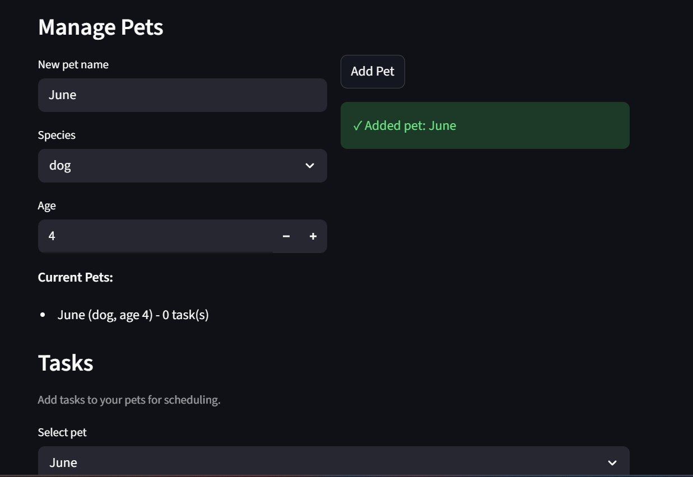
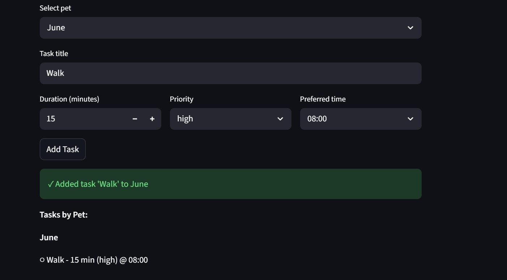
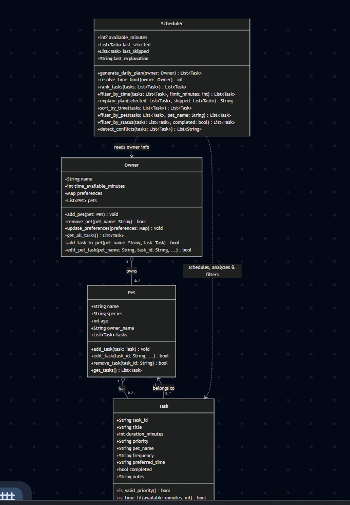

# PawPal+ (Module 2 Project)

You are building **PawPal+**, a Streamlit app that helps a pet owner plan care tasks for their pet.

## Scenario

A busy pet owner needs help staying consistent with pet care. They want an assistant that can:

- Track pet care tasks (walks, feeding, meds, enrichment, grooming, etc.)
- Consider constraints (time available, priority, owner preferences)
- Produce a daily plan and explain why it chose that plan

Your job is to design the system first (UML), then implement the logic in Python, then connect it to the Streamlit UI.

## What you will build

Your final app should:

- Let a user enter basic owner + pet info
- Let a user add/edit tasks (duration + priority at minimum)
- Generate a daily schedule/plan based on constraints and priorities
- Display the plan clearly (and ideally explain the reasoning)
- Include tests for the most important scheduling behaviors

## Getting started

### Setup

```bash
python -m venv .venv
source .venv/bin/activate  # Windows: .venv\Scripts\activate
pip install -r requirements.txt
```

### Suggested workflow

1. Read the scenario carefully and identify requirements and edge cases.
2. Draft a UML diagram (classes, attributes, methods, relationships).
3. Convert UML into Python class stubs (no logic yet).
4. Implement scheduling logic in small increments.
5. Add tests to verify key behaviors.
6. Connect your logic to the Streamlit UI in `app.py`.
7. Refine UML so it matches what you actually built.
## 🐾 Features

PawPal+ includes intelligent scheduling algorithms and comprehensive pet care management:

### Core Scheduling Algorithms

- **Daily Plan Generation** (`generate_daily_plan`): Orchestrates the entire scheduling process, filters out completed tasks, ranks by priority, and greedily selects tasks that fit within available time. Returns optimized daily schedule with explanation.

- **Priority-Based Task Ranking** (`rank_tasks`): Sorts tasks by priority level (high → medium → low), with secondary sort by duration (shorter tasks first when priorities equal). Ensures high-priority care (feeding, medications) takes precedence.

- **Time-Constrained Greedy Selection** (`filter_by_time`): Sequentially fits ranked tasks into available minutes, skips tasks that exceed time limit, and respects owner's daily time constraint.

### Task Analysis & Querying

- **Chronological Time Sorting** (`sort_by_time`): Organizes tasks by preferred time in HH:MM format (earliest → latest). Treats invalid times as end-of-day (23:59) and places flexible "any time" tasks at the end for visibility.

- **Pet-Specific Filtering** (`filter_by_pet`): Returns all tasks for a specific pet with case-insensitive pet name matching. Enables quick workload analysis per pet.

- **Status-Based Filtering** (`filter_by_status`): Separates incomplete tasks from completed ones. Supports "remaining work" vs. "completed review" views.

### Conflict & Validation

- **Scheduling Conflict Detection** (`detect_conflicts`): Identifies multiple tasks scheduled at identical times and generates warning messages (e.g., " CONFLICT at 10:00: Dog Training (Buddy), Cat Play (Max)"). Ignores flexible "any time" tasks and returns list of warnings for graceful handling.

- **Recurring Task Automation** (`mark_completed`): Marks a task as completed and auto-generates next occurrence for daily tasks (tomorrow, +1 day), weekly tasks (next week, +7 days), or returns None for one-time tasks. Uses Python's `timedelta` for date calculations.

### Explanation & Transparency

- **Plan Rationale Explanation** (`explain_plan`): Generates human-readable summary of selected tasks, lists skipped tasks and reason (time limit exceeded), shows total time allocation, and builds transparency into scheduling decisions.

### UI/UX Features

- **Professional Task Display**: Conflict warnings with color-coded alerts (`st.warning`), tabular schedule view with pandas DataFrame, and task metrics (Tasks Today, Total Time, Time Left).

- **Multi-Mode Task Analysis**: View all tasks sorted by time, filter tasks by specific pet, or split tasks by completion status (Pending vs. Completed).

**Algorithm Complexity**: Sorting O(n log n), Filtering O(n), Greedy selection O(n), Conflict detection O(n), Overall plan generation O(n log n)

## 📸 Demo

### Add Pet Screen


### Add Task Screen


### Conflict Detection Screen


### Final UML Diagram


## Testing PawPal+

A comprehensive automated test suite ensures the reliability of scheduling and filtering logic.

### Running Tests

```bash
python -m pytest tests/test_pawpal.py -v
```


### Test Coverage

The test suite includes **27 automated tests** organized into 9 test classes:

| Feature | Tests | Coverage |
|---------|-------|----------|
| **Task Completion** | 1 | Basic task state tracking |
| **Task Addition** | 1 | Pet-task association |
| **Sorting by Time** | 3 | Chronological ordering, flexible times, empty lists |
| **Recurring Tasks** | 3 | Daily/weekly auto-generation, one-time tasks |
| **Conflict Detection** | 5 | Same-time conflicts, multiple conflicts, no conflicts, flexible times, empty lists |
| **Filtering by Pet** | 3 | Correct filtering, case-insensitivity, empty results |
| **Filtering by Status** | 3 | Incomplete tasks, complete tasks, empty results |
| **Priority Ranking** | 2 | Priority ordering, secondary sort by duration |
| **Daily Plan Generation** | 3 | Time limit respect, empty owners, completed task exclusion |
| **Edge Cases** | 2 | Invalid time formats, zero-duration tasks, large task lists |

### What We Test

 **Expected behavior**
- Tasks sort correctly by time (HH:MM format)
- Daily/weekly tasks auto-create next occurrence
- Conflicts trigger warnings without crashing
- Filters work with case-insensitivity
- Scheduler respects available time limits
- Completed tasks are excluded from plans

✅ **Edge Cases** (Boundary conditions)
- Empty task/pet lists
- Tasks with flexible "any" time
- Invalid time formats (graceful degradation)
- Zero or negative task durations (skipped)
- Large task lists (100+ tasks)
- Multiple tasks at exact same time
- One-time vs. recurring tasks

### Test Results

```
======================= 27 passed in 0.20s =======================
```

### Confidence Level: (4 stars)

**Why high confidence:**
- All core scheduling behaviors verified by automated tests
- Edge cases handled gracefully without crashes
- Recurring task logic validated with timedelta calculations
- Conflict detection confirmed for multiple scenarios
- Performance tested with large task lists (100+ tasks)
- Filtering logic works across pets, times, and statuses
- Time constraint enforcement validated

**Limitations to note:**
- Tests assume tasks stay within a single day (no multi-day validation)
- No tests for concurrent access or multi-user scenarios

